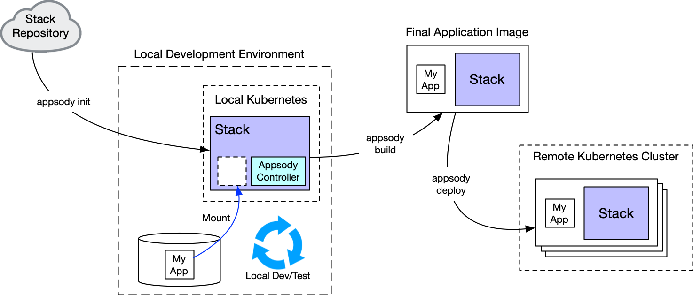

### Cloud native development grows up

When you book an airline ticket, apply for a new passport, access your insurance documents or bank account, you're typically relying on software built by enterprise developers in corporate labs and cities around the world.

Enterprise developers are busy people. Customer's [expectations are higher than they've ever been](https://www.gartner.com/en/newsroom/press-releases/2019-04-04-gartner-says-the-future-of-app-development-is-multiex) for fast, mobile, and secure access to information. We already accept that microservices and cloud-based solutions offer the only real flexible, scalable future for the enterprise. Yet [only 20% of enterprise software has moved to the cloud](https://www.ibm.com/blogs/cloud-computing/2019/03/05/20-percent-cloud-transformation/).

What is preventing more companies from moving to the cloud? Enterprise developers are often pressed for time to learn on the job. Even if they have time, it can be difficult knowing where to start with cloud-native development. The technology is constantly evolving, and opinions on best tools and approaches vary even within small organizations.

In this blog post, we introduce you to new cloud-native products and open source projects from IBM that simplify your journey to the cloud.

#### Cloud Pak for Applications

[Cloud Pak for Applications](https://www.ibm.com/cloud/cloud-pak-for-applications) aims to clear some of the mystery around Cloud Native development by:

* Bundling the best in class libraries and frameworks for developing secure, fast and scalable solutions
* Instilling customizable and consistent access to frameworks approved by an organization.

The image below shows the underlying technology that is included in Cloud Pak for Applications:

<!--EM: For this image, is there a rhyme or reason as to why things are ordered the way that they are? Are the different rows indicative of something? I think we need to call it out like you did below in the Kabanero image. From my (limited) understanding, I think what you’re trying to get out is that the top row is all the tools and frameworks you need, OpenShift is where/how you containerize them and the bottom line is where you deploy. – is that correct?)-->

Cloud Paks for Applications contains a few big components, one of which is Kabanero - a collection cloud-native tools and libraries that we think are essential for cloud-native development. <!--EM: Or we could say: we think are the best to use for clodu-native dev).-->

We're introducing a new collection of code patterns, articles and tutorials that gently introduce the concepts of Kabanero within Cloud Pak for Apps as a smart, disciplined and consistent approach to creating cloud native applications in the enterprise. <!--EM: I would take this out for now, but maybe add it later since the first wave of content is about Appsody/Codewind and not necessarily Kabanero focused. Or maybe we say something like: We're introducing new [content] to introduce you to the underlying ICPA technologies-->

Because Kabanero is a core component of our cloud-development offering, let's take a closer look at the underlying technology.

#### Kabanero development technologies

[Kabanero](https://kabanero.io/) is the open source foundational layer of Cloud Paks for Applications. Kabanero itself is made up of accepted, best-in-class cloud technologies which are all open source. You can see a graphical representation of many of the important technologies below:

One of the special ingredients in Kabanero is [Appsody](https://appsody.dev/) which uses technology stacks and templates to create a disciplined and consistent approach to developing apps within an enterprise organization.

Our approach to creating developer resources around Kabanero and Cloud Paks for Apps is to focus on workflows using the cloud DevOps components <!--EM:do we need to name those components explicitly?-->, providing tutorials around them, and code patterns that can be cloned and explored as reference models. In our first collection of developer resources, we're sharing an Appsody code pattern that walks through the basics of creating an application that has two microservices - with presentation and business logic, as well as digging into approaches for using Appsody in your own projects. <!--EM: i'll come back and add appropriate links once that content is live. if it's not ready in time, we can always comment this last line out and add it back once the content is live-->

#### Building with Appsody for consistent results

[Appsody](https://appsody.dev) is an open source project that simplifies and controls cloud-native application development. Appsody's primary component is a stack, which builds a pre-configured Docker image that developers can immediately use to create applications in a cloud environment. Appsody allows stack builders to decide which parts of the users' resulting application images are fixed (a set of technology choices and configurations defined by the stack image) and which parts stack users can modify/extend (templates). 

One way to think about Appsody is that it can give developers the advantages of a Platform as a Service (PaaS) environment (in terms of not having to worry about installing and configuring the underlying technology components), while allowing architects the flexibility to define those technology components using Docker images.

##### Appsody stacks

An Appsody stack represents a pre-configured set of technologies aimed at simplifying the building of a particular type of cloud native application. This might include a particular environment (for example, `node.js`, or perhaps `python-flask`), combined with integrated choices for monitoring, logging etc. Stacks are published in stack repositories, which can either be [public](https://appsody.dev) or private to an enterprise. Developers can then use the Appsody CLI to pull in the appropriate stack for the application they are building. Kabanero contains all the tools for using and contributing to public stack repositories, as well as a set of curated stacks suitable for the enterprise.

Appsody goes even further than simplifying the use of pre-configured technologies. It enables developers to create and test applications within a local containerized environment from the start using Rapid Local Development Mode. After those initial tests are run, developers can then deploy the final application to cloud-based testing and production clusters. Developing in containers from the start reduces the likelihood of subtle problems being introduced when containerization is added late in the development process.

<!--EM: Should we explicitly call out the fact that architects are the ones who are usually controlling/changing the stacks, while developers are using the templates?-->

##### Appsody templates

Appsody stacks come with one or more templates. A template represents a starter application using that stack and comes ready to be run and deployed. Developer can modify the template to build out their application.

The following image shows the flow of how a developer uses Appsody to pull down and modify a stack, build it and then deploy it to a remote Kubernetes cluster. <!--EM: Writing this out for accessibility reasons, but also wondering if we need to give more context to exactly what is happening in this image-->

### Ready to start?
Now that you understand the technology that underlies IBM Cloud Pak for Applications, you're ready to start exploring the content that we've created. We've selected two different paths to help you get started with Cloud Pak for Applications:

* Developer's Guide to Cloud Pak for Applications
* System Architect's Guide to Cloud Pak for Applications
