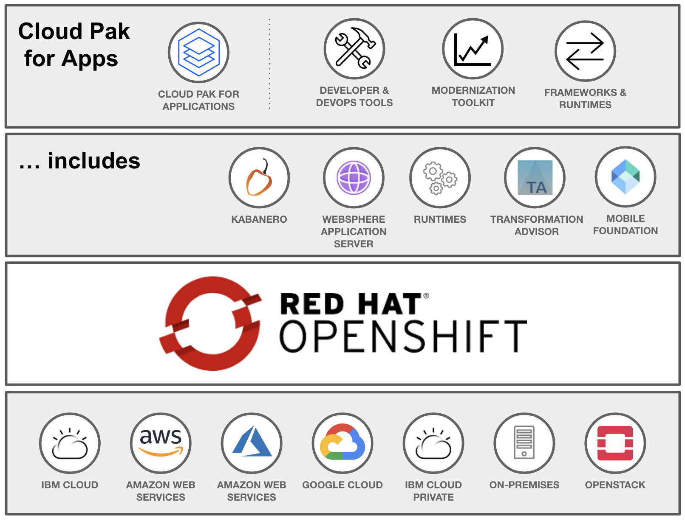

### Cloud Native Development Grows Up

When we book an airline ticket, apply for a new passport, access our insurance documents or bank account, we're typically relying on software built by enterprise developers in corporate labs in cities around the world.

Enterprise developers are busy people. Customer's [expectations are higher than they've ever been](https://www.gartner.com/en/newsroom/press-releases/2019-04-04-gartner-says-the-future-of-app-development-is-multiex) for fast, mobile, and secure access to information. We already accept that microservices, and cloud based solutions offer the only real flexible, scalable future for the enterprise. Yet [only 20% of enterprise software has moved to the cloud](https://www.ibm.com/blogs/cloud-computing/2019/03/05/20-percent-cloud-transformation/).

Enterprise developers are often pressed for time to learn on the job. Even if they have time, it can be difficult knowing where to start with cloud native development. The technology is constantly evolving, and opinions on best tools and approaches vary even within small organizations.

#### Cloud Pak for Applications

[Cloud Pak for Applications](https://www.ibm.com/cloud/cloud-pak-for-applications) aims to clear some of the mystery around Cloud Native development by firstly bundling the best in class libraries and frameworks for developing secure, fast and scalable solutions, and secondly by instilling customizable and consistent access to frameworks approved by an organization.

Cloud Paks for Applications contains a few big components, one of which is Kabanero - a collection of best practice cloud native tools and libraries.

We're introducing a new collection of code patterns, articles and tutorials that gently introduce the concepts of Kabanero within Cloud Pak for Apps as a smart, disciplined and consistent approach to creating cloud native applications in the enterprise.

#### Kabanero development technologies

Cloud Paks for Applications is built on an open source foundational layer called [Kabanero](https://kabanero.io/). The technologies that Kabanero is composed of are accepted best in class cloud technologies, themselves all open source. You can see a graphical representation of many of the important technologies below:

One of the special ingredients in Kabanero is [Appsody](https://appsody.dev/) which creates a disciplined and consistent approach to developing apps within an enterprise organization. You can read more about Appsody below.

Our approach to creating developer resources around Kabanero, and Cloud Paks for Apps is to focus on workflows using this cloud devops components - providing tutorials around them, and code patterns that can be cloned and explored as reference models. In our first collection of developer resources, we're sharing an Appsody code pattern that walks through the basics of creating a two microservice application - with presentation and business logic, as well as digging into approaches for using Appsody in your own projects.

#### Building With Appsody For Consistent Results

[Appsody](https://appsody.dev) is an open source project that simplifies and controls cloud native application development. Appsody's primary component is a stack, which builds a pre-configured Docker image that is ready to be used by developers to create applications in a cloud environment. Appsody allows stack builders to decide which parts of the users' resulting application image are fixed (a set of technology choices and configurations defined by the stack image) and which parts stack users can modify/extend (templates). One way to think about Appsody is that it can give developers the advantages of a PaaS environment (in terms of not having to worry about installing and configuring the underlying technology components), while allowing Architects the flexibility to define those technology components using docker images.

##### Appsody Stacks

An Appsody stack represents a pre-configured set of technologies aimed at simplifying the building of a particular type of cloud native application. This might include a particular environment (e.g. `node.js`, or perhaps `python-flask`), combined with integrated choices for monitoring, logging etc. Stacks are published in stack repositories, which can either be [public](https://appsody.dev) or private to an enterprise. Developers can then use the Appsody CLI to pull in the appropriate stack for the application they are building. Kabanero contains all the tools for using and contributing to public stack repositories, as well as a set of curated stacks suitable for the enterprise.

Appsody goes even further than simplifying the use of pre-configured technologies, in that it enables application development & test to take place within a local containerized environment from the start (Rapid Local Development Mode), ahead of deploying the final application to cloud-based test & production clusters. Developing in this way minimizes the chance of subtle problems being introduced by adding containerization late in the development process.

##### Appsody Templates

Appsody stacks come with one of more templates. A template represents a starter application using that stack, and is already runnable and deployable. A developer can then take this template and modify it to build out their application.

_would like to include a visual_
