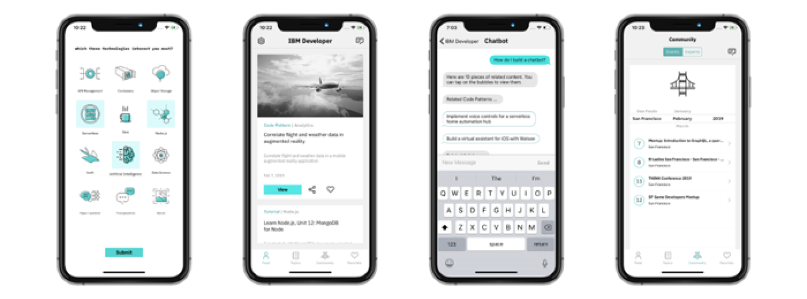
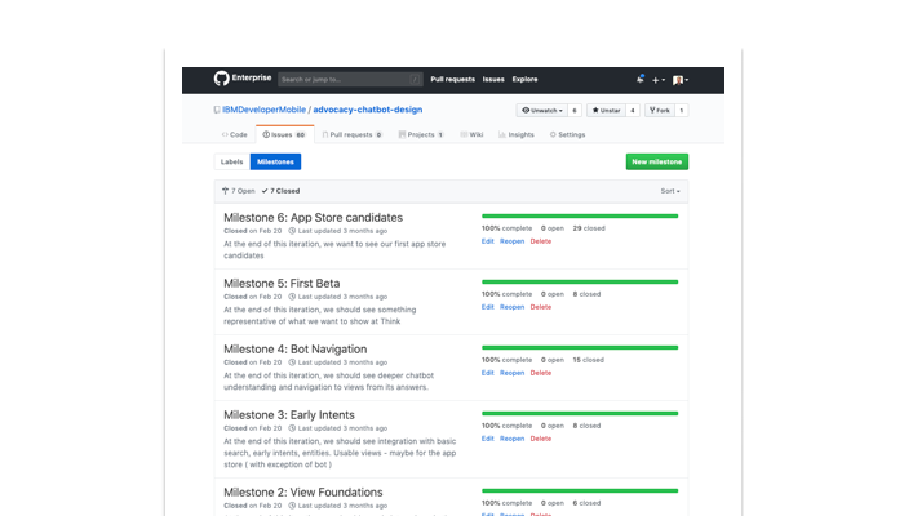
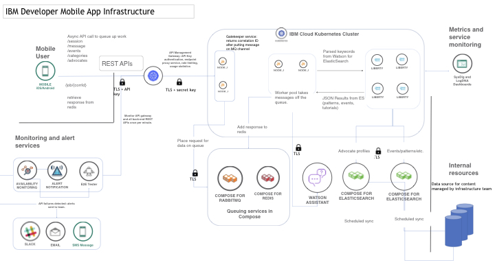
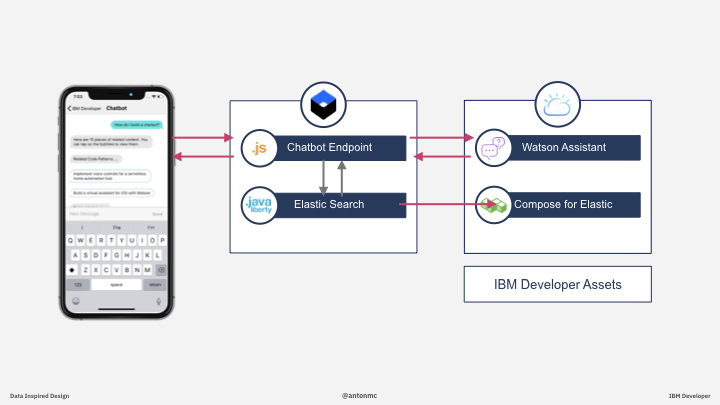

# Rapid development of scaleable mobile apps 
{ THIS IS A GOOD TITLE FOR THE ARTICLE;  WE NEED TO COME UP WITH A GOOD SUBTITLE THAT CAN CONTAIN THE TECH/COMP USED, LIKE CONTAINERS, WATSON SERVICES, ELASTIC SEARCH, ETC }

Many businesses need to create new mobile experiences from datasets that were not structured with mobile in mind. { WHAT DO YOU MEAN BY "from datasets..." } 

Earlier this year we launched a native mobile app version of IBM Developer.

It introduced an experimental chatbot component that used Elastic Search. It was built in just 12 weeks with a very small team of contributors, distributed across four continents! A mini product creation, from concept to corporately approved app, built on IBM Cloud.

Our young IBM Developer App uses Elastic Search to index a library of content. We created APIs around the indexed content for various needs.

Equipped with a set of tailored APIs, we can develop efficient mobile app views - a chatbot, code content views, an event app, all of which can liberate the legacy content in fresh, modern ways.

Customer's [expectations are higher than they've ever been](https://www.gartner.com/en/newsroom/press-releases/2019-04-04-gartner-says-the-future-of-app-development-is-multiex) for fast, mobile, and secure access to information. Cloud-based, container-based solutions with microservices offer the only real flexible, scalable future for enterprise software. Yet [only 20% of enterprise software has moved to the cloud](https://www.ibm.com/blogs/cloud-computing/2019/03/05/20-percent-cloud-transformation/).

Our IBM Developer mobile app was created as a side project, which we've watched and learned from. The team that built it was new to mobile app development, and had to research, learn, and adapt quickly, so that the app was robust and scalable for thousands of people to use at the same time. We thought that we'd turn our experience into a collection of code patterns and articles that enterprise teams, and independent developers, might learn from too. A lot of our approaches are 'standard' patterns for surfacing and scaling data with Kubernetes or OpenShift.

## Agile/Scrum approach

We wanted to build the chatbot and mobile app in time for the 2019 Think Conference, which was held in February. Our work started at the tail end of 2018. We scoped out milestone stepping stones, not more than 2 weeks apart. Each milestone was purposefully a mini internal product, albeit some of those mini products did very little.

We set up our milestones within our GitHub repo.

{ SAY SOMETHING MORE HERE ??? }

## System architecture

A common problem for publicly consumable mobile apps is how to develop for scale. Turning an idea into a working app is one step, but what happens when 1000s of people access the mobile app at the same time. Developing a mobile app at scale is an especially thorny problem for chatbots because they will need to process thousands or tens of thousands of messages at a time.

The IBM Developer Mobile app backend queues incoming messages so that they can be processed at a pace that the Watson Assistant Service and business logic can handle. The mobile app relies on a Rabbit MQ implementation to queue the messages. { THIS ONE? LET'S LINK TO THE SERVICE IN THE CLOUD CATALOG:  https://cloud.ibm.com/catalog/services/compose-for-rabbitmq }

From there the messages are passed into Watson Assistant where the messages are parsed to understand the intent and the entities (_subjects_) that they relate to.

The intent and entity information forms the basis of the queries that are passed into Elastic Search. The Elastic Search was indexed to align similarly to the Watson Assistant conversation model, so that the confidence levels are as high as possible for the queries sent.

Business logic related to the chatbot is coded in Node.js and runs in a Kubernetes cluster. The Elastic Search endpoints run in Java in Kubernetes, too, which highlights the versatility of the programming approaches where different engineers on the team may have differing coding skills or when one programming language works well to solve a specific problem.

## Creating a chatbot built on legacy data  

Many companies or organizations are interested in creating text or voice interfaces for access to their services or legacy data. For example, a government agency that might want to automate questions about a policy document, or a realty firm that wants to create voice interfaces around property searches.

Some people perceive that it is fast and easy to create a chatbot. While it is quick these days to put the framework in place to build a chatbot around, a quality experience for a chatbot just can't be made instantly.

Elastic Search is a powerful and efficient way to index a set of text-based data around pre-determined set of topics. It also is a natural fit for aligning with a conversation model.

Indexing legacy data using Elastic Search can break down non-structured text data into data structures that can fuel a chatbot.

We've published a code pattern all about [integrating Elastic Search with Watson Conversation](https://developer.ibm.com/patterns/building-a-chatbot-with-kubernetes-watson-assistant-and-elastic-search/), just like we did with building the IBM Developer Mobile app.

## Testing for scale using Artillery

How can you know if your mobile app is going to perform the same way for 1 developer as for 100,000 developers, _before_ 100,000 developers try it?

By simulating thousands of messages being sent to the app at the same time, it is possible to explore the behavioral characteristics of a system under stress.

For the IBM Developer Mobile app, we used a tool called [Artillery](https://artillery.io/).  { SAY SOMETHING MORE HERE }

## Monitoring usage with LogDNA  

The IBM Developer Mobile app is instrumented with [LogDNA](https://cloud.ibm.com/catalog/services/logdna) for monitoring the requests between the mobile applications and the cloud software that is serving them.

LogDNA helps us understand the ratio of requests between Android and iOS devices. It also illustrates the frequencies and patterns of use.

For instance, we were able to correlate a spike in usage of the app with an announcement about the availability of it at an event in India.

It is fairly quick and easy to set up a mobile app with LogDNA. The return on investment is huge.  LogDNA has such a short set up time, and it offers such insightful results that enable evidence based decisions about the value and evolution of a mobile app. 

## Conclusion

{ NEED TO ADD A SECTION TO WRAP UP THE ARTICLE... }
