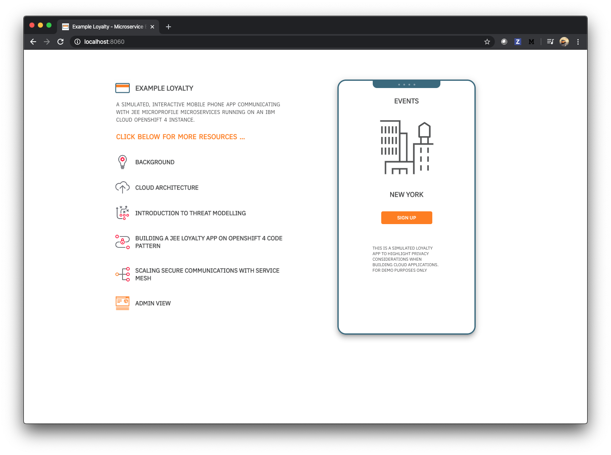

## RedHat OpenShift 4.3 on IBM Cloud

RedHat OpenShift continues to evolve to springboard Cloud Native Development. As our [history of Kubernetes, and OpenShift](https://developer.ibm.com/blogs/a-brief-history-of-red-hat-openshift/) blogpost suggested last year, the recent V4 release of OpenShift V4 is _the_ well considered contemporary enterprise platform, for building production ready apps on today, and for the decade ahead.

We're excited that OpenShift 4.3 is [now available on IBM Cloud]().

In this blog post I highlight some of the new features of OpenShift 4, and also introduce a new collection of developer resources here on the IBM Developer website, that explore those features, while digging into considerations for building secure, privacy conscious applications with container technology.

### What's new in OpenShift V4?

IBM Cloud is updating from OpenShift V 3.11 to [OpenShift V 4.3](https://docs.openshift.com/container-platform/4.3/release_notes/ocp-4-3-release-notes.html). Now, OpenShift is even more packed with enterprise developer features, a few of which I'll highlight below:

#### New Dashboard

If you're used to OpenShift 3.11, then you'll immediatly notice a visual refresh of the user interface. It is designed to be cleaner, and more organized - more focus, less noise.

Here's a screenshot of the dashboard for our 'Example Loyalty' app that we've developed to explore some of the new features of OpenShift 4.

and here's a screenshot of the cool new topology view that helps visualize the microservice architecture of a cloud native app, again showing the deployed components of our new 'Example Loyalty' app. You can read more about our intention with the app below.

You can read more about [OpenShift 4.3 Dashboard refinements and the new Project dashboard](https://blog.openshift.com/openshift-4-3-dashboard-refinements-and-the-new-project-dashboard/).

#### Operator Hub

The [Operator Framework](https://github.com/operator-framework) is an open source toolkit to manage Kubernetes native applications, called Operators, in an effective, automated, and scalable way. OpenShift 4 has been re-architected around Operators. Where Kubernetes enabled developers to methodically 'containerize' applications, Operators enable developers to automate the management of related components of an application, for instance databases, or other stateful elements, in a consistent, repeatable and scalable way.

In addition, to Operators becoming part of Kubernetes fabric in OpenShift 4, RedHat have introduced a marketplace for finding [Operators that can accellerate development of an application](https://enterprisersproject.com/article/2019/2/kubernetes-operators-plain-english?page=1). This new [Operator Hub](https://operatorhub.io/) is also part of OpenShift. You can find out more in our [Operator tutorial]()

#### OpenShift Service Mesh

Service Meshes can instill a consistent development approach, and infuse inter service communication with security among other features. I noticed that it is a choice approach for solving problems of scale, and order in big applications, and across large companies - from presentations at [KubeCon North America last year](https://www.youtube.com/watch?v=Z6aN3Smt-9M). 

OpenShift 4 has adopted [Istio](https://istio.io/), the emerging service mesh of choice for Kubernetes based systems, and based its own service mesh on that technology.

In addition, the lastest version of Istio offers helpful [security features](https://istio.io/docs/concepts/security/) which we [explore in a new code pattern]()

#### Openshift Serverless

Serverless computing is increasing in developer appeal because it can offer reliability and scale of cloud computing. Code is typically written as small executable functions, an approach that sometimes requires a little lateral thinking to achieve a significant outcome.

Serverless development can now be enabled on OpenShift 4 through the adoption of the [open source Knative project](https://cloud.google.com/tekton).  Here's a [tutorial](https://developer.ibm.com/recipes/tutorials/deploy-a-serverless-application-using-knative-in-openshift-4-2-cp4app-4-0/)

#### OpenShift Pipelines

Cloud Native CI/CD pipelines were [introduced in OpenShift 4.1](https://blog.openshift.com/cloud-native-ci-cd-with-openshift-pipelines/)

OpenShift Pipelines build upon the [Tekton open source project](https://cloud.google.com/tekton) to enable teams to build Cloud native delivery pipelines that they can fully control and own the complete lifecycle of their microservices without having to rely on central teams to maintain and management a CI server, plugins, and its configurations.

There is a new pipeline UI available, and in our introductory code pattern, we build in a rudimentary scanning step into a deployment pipeline, to demonstrate the potential for baking in security steps, with this emerging approach too.

#### Enhanced Security

Data security is an enormous concern these days, especially for enterprise businesses that handle 10s, or 100s of thousands of client records. 

[OpenShift 4.3 delivers FIPS (Federal Information Processing Standard) compliant encryption and additional security enhancements](https://blog.openshift.com/introducing-red-hat-openshift-4-3-to-enhance-kubernetes-security/). When OpenShift runs on Red Hat Enterprise Linux booted in FIPS mode, OpenShift calls into the Red Hat Enterprise Linux FIPS validated cryptographic libraries. The [go language toolset](https://developers.redhat.com/blog/2019/06/24/go-and-fips-140-2-on-red-hat-enterprise-linux/?extIdCarryOver=true&sc_cid=701f2000001OH74AAG) that enables this functionality is available to all Red Hat customers

## The evolving world of privacy conscious applications

As noted above, OpenShift 4.3 introduces more security features for data sensitive apps and systems.

One of the themes that stood out to me at KubeCon Europe last year was the [interest in GDPR](https://www.youtube.com/watch?v=sKaeOApBPsw). 

GDPR has had a significant impact to data management since it was [introduced in 2018](https://www.forbes.com/sites/andrewrossow/2018/05/25/the-birth-of-gdpr-what-is-it-and-what-you-need-to-know/#3e15cc9055e5). A couple of significant cases were filed against [airlines](https://www.cnet.com/news/british-airways-faces-record-breaking-230m-gdpr-fine-for-2018-data-breach/) and [hotels](https://www.forbes.com/sites/kateoflahertyuk/2019/07/09/marriott-faces-gdpr-fine-of-123-million/#1b46964c4525) for data sensitivity violations. This is especially in that these are typcial 'enterprise' software problemspaces. 

While exploring OpenShift 4.3, I wanted to understand what it really takes to build secure, more private applications. What became clear was that there is no instant way, or even possible way of building a perfectly secure application - security is an ongoing challenge. 

There are choices like building on a FIPS compliant platform, that can start an app off with a solid security foundation, and then there are  approaches and practices, and awareness that can establish a base of security, for cloud native applications, and we can grow to understand a wider range of threats and ideas for thwarting them.

A helful discovery, again from a KubeCon talk that I attended was about threat modeling using the [STRIDE model](https://en.wikipedia.org/wiki/STRIDE_(security). We have [written our own article]() that digs a little into what the STRIDE model is, and runs through a quick exercise considering options for tackling the different dimenstions of security threats.

So we wanted to create a collection of OpenShift 4.3 that introduces some of the main new features of the platform, while also thinking about how to build more secure applications. So we built a basic customer loyalty app.

## Building a customer loyalty app example

The idea for building a loyalty app came from a real world request to build event checkins into our IBM Developmer mobile app. We're still thinking about that idea. In our first version of our dev app, we were careful to avoid storing any user data at all, and so it was intriguing to question what it would take to store data in a GDPR friendly way.

We began scaffolding the app on OpenShift, to make ourselves question the steps we'd take to make it safe and secure. We turned this prototype into a web based simulator for sharing our insight.

And we've open sourced our work in the form of a collection of code patterns, tutorials and articles that show how we've used OpenShift 4 features to 'build smart, build secure'.

Our collection includes:

- A blogpost highlighting some of the new features in OpenShift 4 that can truly help develop cloud native applications.

- A JEE microprofile code pattern using operators to connect to a postgres database.

- An article that presents an overview on using Operators in OpenShift 4.

- A tutorial that steps through creating CI/CD pipelines that include custom steps on OpenShift 4.

- A code pattern that digs into TLS/security in OpenShift service mesh.

- An article that considers designing for privacy, and the STRIDE threat model.

In the coming weeks, we'll build a little more content around this concept, including a code pattern that shows how to build with the emerging open standard for web components in the front end.

Our team is not a team of security experts. IBM, like many big companies has its own advisors, and systems that are behind firewalls to protect data, so we would have an advanced starting point for a real application.

However we think security is not just for experts to care about, and even for the experts, Cloud Native is a whole new world. We wanted to dive in, and understand the arena more, raise awareness of the subject, and look at the options for starting from scratch too. There's a lot to think about.

## Prototype loyalty app architecture 

Here's the basic architecture of the loyalty app system we built on OpenShift 4. We use OpenShift pipelines and operators to deploy and set up a CI/CD for this system. You can fork the code to run the pipeline yourself, fork the consitituent repo parts, or play with a live running version of the app.

