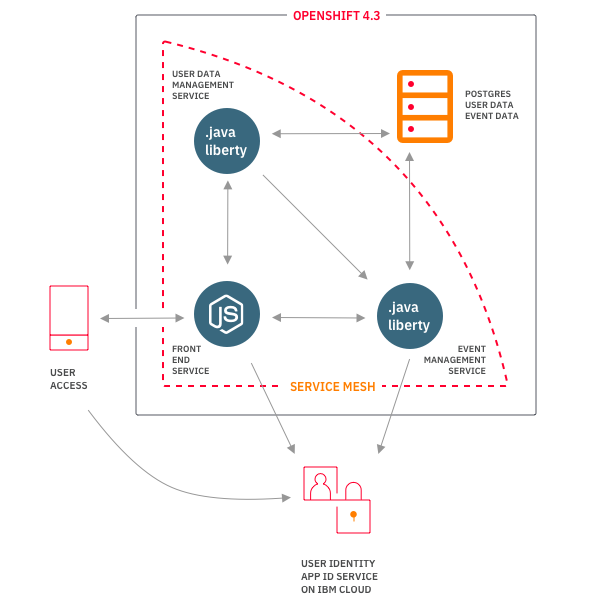
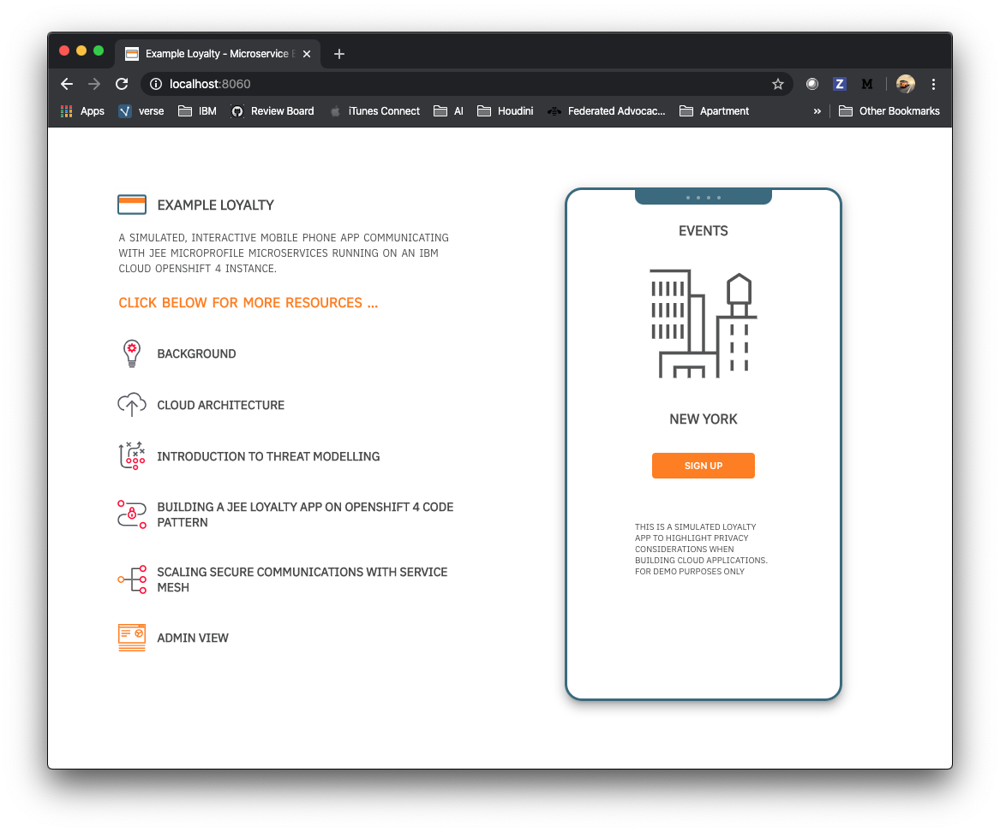
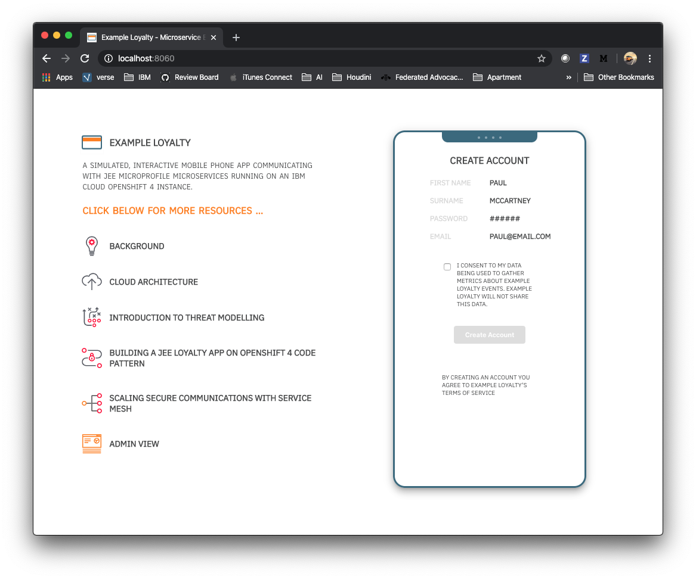
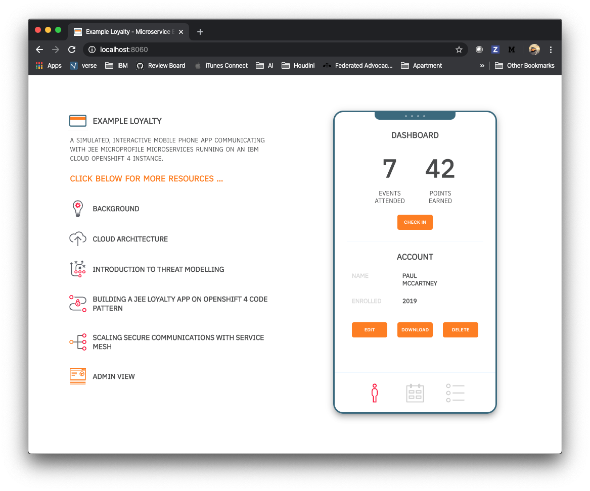

# Introductory Thoughts On Designing for Privacy and Security

If data privacy and security were easy, instant, and immediate features to build into applications, then there would be no data breaches, or invasion of data privacy. 

The truth is that there is no single silver bullet for security in software systems. However, there are [strong building blocks](https://blog.openshift.com/introducing-red-hat-openshift-4-3-to-enhance-kubernetes-security/) and good security habits that can help mitigate threats foundationationally.

This article considers privacy and security as design considerations, throughout the life of an example application. 

## Background

Earlier this year, my team began responding to a feature request for one of our mobile apps, which would require personal information to be stored. In the first release of our app, we had avoided storing personal information at all, to simplify liability within it. If we were to implement a solution for this feature request, then we needed to understand what it would actually take to build a version of the app that handled privacy and security well. 

Our back end is completely cloud based, and running on IBM Cloud Kubernetes services, database services.

Like very many other apps, our mobile app began life as a tiny concept, that was built as quickly as possible by a hastily assembled small team. None of the team are security experts. So, this feature request forced us to understand Cloud Native security some more.

In the end, at IBM we have processes, people and mechanisms in build for sensitive data in more controlled ways, who my team can consult although Cloud technolgies are evolving rapidly, so we're constantly learning too. However, I wanted to understand what it would be like to build secure, private cloud native apps for a startup.

At the end of last year I attended a really interesting talk at KubeCon that introduced me to the concept of [threat modeling](https://en.wikipedia.org/wiki/Threat_model), and the useful [STRIDE methodology](https://en.wikipedia.org/wiki/Threat_model#STRIDE_methodology) acronym/framework for considering threats to a system.

## Threat Modeling with STRIDE

Threat modeling is a process by which potential threats, vulnerabilities or the absence of safeguards, can be identified, enumerated, and mitigations can be prioritized. 

The purpose of threat modeling is to provide defenders with an analysis of what controls or defenses need to be included, given the nature of the system, the probable attacker's profile, the most likely attack vectors, and the assets most desired by an attacker. 

Recently we've all had first hand experience of threat modeling in real life as we have learned to survive in a pandemic. We've indentified the threat of infection from other people, or from surfaces we touch, or the threat of infecting other people, and we've thought about ways to thwart those threats by keeping social distance, washing our hands more, wearing a mask. Every interaction we have is considered and measured for threats from the virus. That's an example of threat modeling.

Threat modeling in software systems is a similar idea. Whether a from a digitial virus or a digital attack, we need to consider the threats and find ways to protect the system.

The STRIDE methodology helps with this process by asking us to consider six areas of threat. I drew above diagram to depict it.

So, let's think through the threats for our mobile app software architecture.

## Threat Modeling for our example Cloud Native Application

Here's the basic cloud architecture for the system we would build to support the user data feature we've been asked for in our mobile app. 

The feature is a loyalty program - the request is for the mobile app to allow people to check in and out of developer tech events, where they would earn loyalty points - just like an airline or hotel loyalty program.

Our cloud software to support the feature would be comprised of three microservices, you can [read more about the architecture here]().

As an exercise, let's consider the different elements of the STRIDE threat model for such a system, and suggest some initial ideas for thwarting threats. This is not a thorough list, just a set of jumping off options we identified for our use case ...

#### [Spoofing](https://en.wikipedia.org/wiki/Spoofing_attack)

*In the context of information security, and especially network security, a spoofing attack is a situation in which a person or program successfully identifies as another by falsifying data, to gain an illegitimate advantage.*

- Make the mobile app available via trusted sources like the Apple App Store, Google Play Store, a recognizable secure domain ( see [IBM Domain Name Services](https://www.ibm.com/ca-en/marketplace/dns) )

- Use industry standard autentication protocols, for example [IBM Cloud App ID](https://www.ibm.com/cloud/app-id)

- Use a cloud provider with the highest level of government certification - see [IBM Cloud Security](https://www.ibm.com/cloud/security)

#### [Tampering](https://en.wikipedia.org/wiki/Tampering_(crime))

*Tampering can refer to many forms of sabotage but the term is often used to mean intentional modification of products in a way that would make them harmful to the consumer.*

- Build with Federal Information Processing Standard compliant encryption container platforms like [RedHat OpenShift 4.3](https://blog.openshift.com/introducing-red-hat-openshift-4-3-to-enhance-kubernetes-security/)

- Scan code for vulnerabilities, for example with [IBM AppScan](https://www.ibm.com/garage/method/practices/manage/tool_ibm_security_appscan/)

#### [Repudiation](https://en.wikipedia.org/wiki/Non-repudiation)

*In digital security, non-repudiation means a service that provides proof of the integrity and origin of data, or an authentication that can be said to be genuine with high confidence.*

- Use a reliable and well featured logging service, such as [IBM Log Analysis With LogDNA](https://www.ibm.com/cloud/log-analysis)

#### [Information Disclosure](https://en.wikipedia.org/wiki/Information_privacy)

*Information disclosure is the unwanted dissemination of data technology, or privacy. legal and political issues surrounding them. It is a violation of data privacy or data protection. The challenge of data privacy is to use data while protecting an individual's privacy preferences and their personally identifiable information.*

- Manage security certificates well, to help encrypt transmission of data, for example with the [IBM Certificate Manager](https://www.ibm.com/cloud/certificate-manager)

- Build on a FIPS approved encryption platform like [RedHat OpenShift 4.3](https://blog.openshift.com/introducing-red-hat-openshift-4-3-to-enhance-kubernetes-security/)

- Benefit from a database hosted with strong enterpise security encryption at rest, for example [IBM Cloud Databases for PostgresSQL](https://www.ibm.com/cloud/databases-for-postgresql)  

- Protect Encryption Keys with [IBM Key Protect](https://www.ibm.com/cloud/key-protect)

#### [Denial Of Service](https://en.wikipedia.org/wiki/Denial-of-service_attack)

*A denial-of-service attack (DoS attack) is a cyber-attack in which the perpetrator seeks to make a machine or network resource unavailable to its intended users by temporarily or indefinitely disrupting services of a host connected to the Internet.*

- protect against DDOS with a reliable public cloud hosting tools, in our case [IBM Cloud Internet Services](https://www.ibm.com/cloud/cloud-internet-services)

- consider rate limiting

#### [Elevation of Privlege](https://en.wikipedia.org/wiki/Privilege_escalation)

*Privilege escalation is the act of exploiting a bug, design flaw or configuration oversight in an operating system or software application to gain elevated access to resources that are normally protected from an application or user.*

There are lots of layers to think about with privlege - database management, endpoint management, container management, and many approaches for managing - a few thoughts ...

- container level [role based access control with RedHat OpenShift](https://docs.openshift.com/enterprise/3.0/admin_guide/manage_scc.html)

- intra microservice security with [RedHat OpenShift Service Mesh](https://istio.io/docs/concepts/security/)

- managing passwords/accounts with [IBM Security Secret Server](https://www.ibm.com/ca-en/marketplace/secret-server)

This article and list is not intended to be a definitive guide for securing your app. The intention is to offer an example of how threat modeling works, and some of the solutions that can help thwart threats.

## GDPR and Privacy By Design

GDPR or the General Data Protection Regulation, is a European Union regulation that helps people gain control over the way companies use their personal data. It was implemented on May 28, 2018, and violating GDPR can carry a fine of 4% of your company's annual revenue, or €20 million, whichever number is larger.

Data can't be protected, unless is is secure, which is why I'm relating GDPR to security when thinking about [designing for privacy](https://gdpr-info.eu/issues/privacy-by-design/). Aside from the financial implications of GDPR, data breaches can leave actual human beings vulnerable to real world implications.

To quote the GDPR Privacy By Design Text:

_The term “Privacy by Design” means nothing more than “data protection through technology design.” Behind this is the thought that data protection in data processing procedures is best adhered to when it is already integrated in the technology when created._

I really like the idea of stepping back when designing an app and trying to model not just the security threats to a software system, but the threats presented by the abuse of a person's personal data within the system. 

In our Example Loyalty app, we built in some simulated UIs to show a few privacy concepts in action.

The app itself is a simulated mobile app for registering, and logging attendance of technology events. In exchange, the attendee receives 'loyalty' points, that they can accumulate and spend on swag.

When the user creates an account they are checking a box to signal their [consent](https://gdpr-info.eu/issues/consent/).

In the account view they can [download](https://gdpr-info.eu/art-20-gdpr/), [delete](https://gdpr-info.eu/art-17-gdpr/), or [edit](https://gdpr-info.eu/art-16-gdpr/) their data 

There are other aspects that we would need to make clear in our example UI for instance the [Right to Restriction of Processing](https://gdpr-info.eu/art-18-gdpr/) and the [Automated Individual Decision Making/Profile](https://gdpr-info.eu/art-22-gdpr/)

It's important to design the APIs and controls for all of these aspects of data management, when creating your app. You can see how we created those APIs for Example Loyalty.